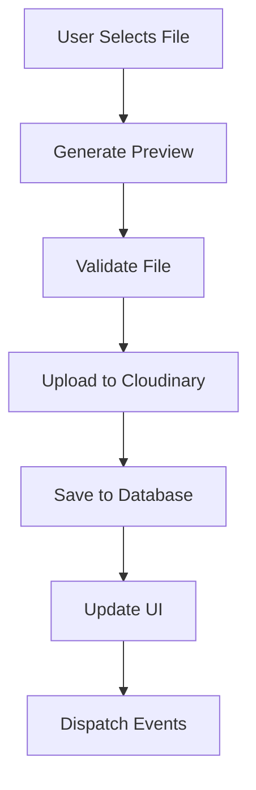
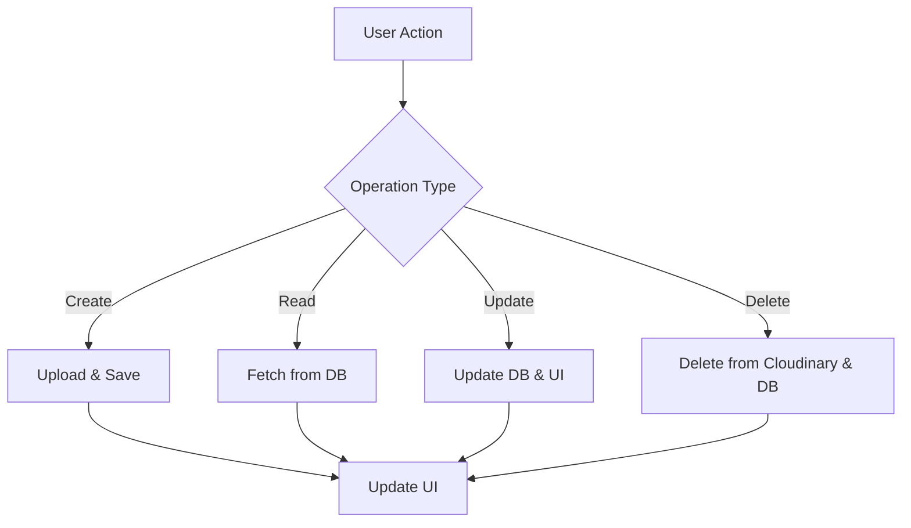

# 🏗️ Complete Image Management Architecture

## 📋 Overview

This is a comprehensive end-to-end image management system built with **Cloudinary SDK v2**, featuring complete CRUD operations, preview functionality, and seamless integration for both carousel and case study editors.

## 🎯 Key Features Implemented

### ✅ **Cloudinary SDK v2 Integration**
- **Direct SDK Usage**: `cloudinary.v2.uploader.upload()` and `cloudinary.v2.uploader.text()`
- **Signed & Unsigned Uploads**: Multiple upload methods with fallback
- **Real-time Progress Tracking**: Upload progress with visual feedback
- **Image Transformations**: Automatic optimization and format conversion
- **Preview Generation**: Client-side preview before upload

### ✅ **Complete CRUD Operations**
- **Create**: Upload images with metadata
- **Read**: Fetch images with filtering and pagination
- **Update**: Edit image details, titles, descriptions
- **Delete**: Remove images from both Cloudinary and database

### ✅ **Preview Functionality**
- **Real-time Preview**: Generate thumbnails before upload
- **Live Preview**: See changes before saving
- **Modal Preview**: Full-size image viewing
- **Responsive Previews**: Optimized for different screen sizes

### ✅ **Carousel Integration**
- **Drag & Drop Upload**: Multiple file upload support
- **Reordering**: Drag and drop to reorder carousel items
- **Active/Inactive Toggle**: Control which images are displayed
- **Auto-play Controls**: Start/stop carousel automation
- **Live Preview**: Real-time carousel preview

### ✅ **Case Study Editor Integration**
- **Section-based Organization**: Hero, Gallery, Process, Results
- **Rich Metadata**: Titles, descriptions, alt text, captions
- **Process Steps**: Numbered process documentation
- **Results Metrics**: Impact measurement tracking
- **Auto-save**: Prevent data loss with automatic saving

## 🏗️ Architecture Components

### **1. Frontend Services**

#### **CloudinarySDKService** (`js/cloudinary-sdk-service.js`)
```javascript
class CloudinarySDKService {
    // Core upload functionality
    async uploadImageWithPreview(file, options)
    async performUpload(file, options, uploadId)
    async generatePreview(file)
    
    // CRUD operations
    async deleteImage(publicId)
    getUploadedImages()
    getImage(publicId)
    
    // Utility methods
    generateThumbnailUrl(publicId, options)
    generateOptimizedUrl(publicId, options)
    showUploadDialog(callback)
}
```

#### **CarouselImageManager** (`js/carousel-image-manager.js`)
```javascript
class CarouselImageManager {
    // Image management
    async uploadSingleImage()
    async uploadMultipleImages(files)
    async processImageUpload(file)
    
    // Carousel controls
    nextSlide()
    previousSlide()
    goToSlide(index)
    startAutoplay()
    stopAutoplay()
    
    // CRUD operations
    editImage(index)
    deleteImage(index)
    toggleImageActive(index)
    
    // Drag & Drop
    handleDragStart(event, index)
    handleDrop(event, dropIndex)
}
```

#### **CaseStudyImageEditor** (`js/case-study-image-editor.js`)
```javascript
class CaseStudyImageEditor {
    // Section management
    switchSection(section) // hero, gallery, process, results
    renderSectionEditor(section)
    
    // Upload methods
    async uploadHeroImage()
    async uploadGalleryImages()
    async uploadProcessImages()
    async uploadResultsImages()
    
    // Preview & Save
    togglePreview()
    showPreviewModal()
    async saveCaseStudy()
    async autoSave()
    
    // Image editing
    editImage(section, index)
    removeImage(section, index)
    showEditImageModal(image, section, index)
}
```

### **2. Backend APIs**

#### **Cloudinary v2 API** (`api/cloudinary-v2.js`)
```javascript
// Upload endpoints
POST /api/cloudinary/upload          // Single image upload
POST /api/cloudinary/upload-multiple // Multiple image upload
POST /api/cloudinary/upload-text     // Text as image upload

// Management endpoints
DELETE /api/cloudinary/delete        // Delete image
GET /api/cloudinary/images          // Get all images
POST /api/cloudinary/transform      // Generate transformed URLs
GET /api/cloudinary/folders         // Get folder structure
```

#### **Carousel API** (`api/carousel.js`)
```javascript
// CRUD endpoints
GET /api/carousel/images            // Get all carousel images
POST /api/carousel/images           // Add new carousel image
PUT /api/carousel/images/:id        // Update carousel image
DELETE /api/carousel/images/:id     // Delete carousel image

// Management endpoints
POST /api/carousel/order            // Update image order
GET /api/carousel/active            // Get active images only
POST /api/carousel/reorder          // Drag & drop reordering
```

#### **Case Study API** (Integrated)
```javascript
// Case study image endpoints
GET /api/case-studies/:id/images    // Get case study images
POST /api/case-studies/images       // Save case study images
PUT /api/case-studies/:id/images    // Update case study images
DELETE /api/case-studies/:id/images // Delete case study images
```

### **3. Database Schema**

#### **Cloudinary Images Table**
```sql
CREATE TABLE cloudinary_images (
    id UUID PRIMARY KEY DEFAULT gen_random_uuid(),
    public_id VARCHAR NOT NULL UNIQUE,
    secure_url VARCHAR NOT NULL,
    width INTEGER,
    height INTEGER,
    format VARCHAR,
    resource_type VARCHAR DEFAULT 'image',
    bytes INTEGER,
    folder VARCHAR,
    tags TEXT[],
    created_at TIMESTAMP DEFAULT NOW(),
    version INTEGER,
    original_filename VARCHAR
);
```

#### **Carousel Images Table**
```sql
CREATE TABLE carousel_images (
    id UUID PRIMARY KEY DEFAULT gen_random_uuid(),
    public_id VARCHAR NOT NULL,
    secure_url VARCHAR NOT NULL,
    thumbnail VARCHAR,
    title VARCHAR NOT NULL,
    description TEXT,
    width INTEGER,
    height INTEGER,
    bytes INTEGER,
    is_active BOOLEAN DEFAULT true,
    order_index INTEGER DEFAULT 0,
    alt_text VARCHAR,
    caption VARCHAR,
    created_at TIMESTAMP DEFAULT NOW(),
    updated_at TIMESTAMP DEFAULT NOW()
);
```

#### **Case Study Images Table**
```sql
CREATE TABLE case_study_images (
    id UUID PRIMARY KEY DEFAULT gen_random_uuid(),
    case_study_id UUID REFERENCES case_studies(id),
    section VARCHAR NOT NULL, -- 'hero', 'gallery', 'process', 'results'
    public_id VARCHAR NOT NULL,
    secure_url VARCHAR NOT NULL,
    thumbnail VARCHAR,
    title VARCHAR,
    description TEXT,
    alt_text VARCHAR,
    caption VARCHAR,
    metrics VARCHAR, -- For results section
    order_index INTEGER DEFAULT 0,
    created_at TIMESTAMP DEFAULT NOW(),
    updated_at TIMESTAMP DEFAULT NOW()
);
```

## 🔄 Data Flow

### **Upload Process**


### **CRUD Operations**


## 🎨 UI Components

### **Upload Zones**
- **Drag & Drop Areas**: Visual feedback for file dropping
- **Progress Indicators**: Real-time upload progress
- **Preview Thumbnails**: Immediate visual feedback
- **Error Handling**: User-friendly error messages

### **Image Management**
- **Grid Layouts**: Responsive image grids
- **Modal Viewers**: Full-size image viewing
- **Edit Forms**: Comprehensive metadata editing
- **Action Buttons**: Intuitive CRUD controls

### **Carousel Controls**
- **Navigation Arrows**: Previous/Next controls
- **Dot Indicators**: Direct slide navigation
- **Auto-play Controls**: Start/Stop automation
- **Reorder Interface**: Drag & drop reordering

### **Case Study Sections**
- **Tabbed Interface**: Section switching
- **Hero Image Area**: Large hero image display
- **Gallery Grid**: Multi-image gallery
- **Process Steps**: Sequential process display
- **Results Showcase**: Impact visualization

## 🔧 Configuration

### **Environment Variables**
```bash
# Cloudinary Configuration
CLOUDINARY_CLOUD_NAME=dgymjtqil
CLOUDINARY_API_KEY=951533987774134
CLOUDINARY_API_SECRET=jTPgMHSl-6m7LptvsBA5eDbOWwc

# Supabase Configuration
SUPABASE_URL=https://fzyrsurzgepeawvfjved.supabase.co
SUPABASE_ANON_KEY=eyJhbGciOiJIUzI1NiIsInR5cCI6IkpXVCJ9...

# Server Configuration
PORT=3005
NODE_ENV=development
```

### **Cloudinary Settings**
```javascript
const cloudinaryConfig = {
    cloudName: 'dgymjtqil',
    apiKey: '951533987774134',
    uploadPreset: 'ml_default', // Must be created in Cloudinary dashboard
    transformation: [
        { quality: 'auto:good' },
        { fetch_format: 'auto' }
    ]
};
```

## 🚀 Usage Examples

### **Basic Image Upload**
```javascript
// Upload single image with preview
const result = await window.cloudinarySDK.uploadImageWithPreview(file, {
    folder: 'portfolio/gallery',
    tags: ['portfolio', 'gallery'],
    transformation: [
        { width: 800, height: 600, crop: 'fill' },
        { quality: 'auto:good' }
    ]
});

console.log('Upload result:', result.url);
```

### **Carousel Management**
```javascript
// Add image to carousel
await window.carouselManager.processImageUpload(file);

// Reorder carousel items
window.carouselManager.handleDrop(event, newIndex);

// Toggle image active state
window.carouselManager.toggleImageActive(index);
```

### **Case Study Editing**
```javascript
// Switch to gallery section
window.caseStudyImageEditor.switchSection('gallery');

// Upload process images
await window.caseStudyImageEditor.uploadProcessImages();

// Save case study
await window.caseStudyImageEditor.saveCaseStudy();
```

## 📱 Responsive Design

### **Mobile Optimizations**
- **Touch-friendly Controls**: Large touch targets
- **Swipe Gestures**: Mobile carousel navigation
- **Responsive Grids**: Adaptive layouts
- **Mobile Upload**: Camera integration

### **Desktop Features**
- **Drag & Drop**: File dropping support
- **Keyboard Shortcuts**: Power user features
- **Multi-select**: Batch operations
- **Context Menus**: Right-click actions

## 🔒 Security Features

### **Upload Security**
- **File Type Validation**: Allowed formats only
- **Size Limits**: Configurable file size limits
- **Virus Scanning**: Cloudinary security features
- **Rate Limiting**: Upload frequency limits

### **Access Control**
- **Authentication**: User-based access
- **Authorization**: Role-based permissions
- **API Keys**: Secure API access
- **CORS Configuration**: Cross-origin security

## 📊 Performance Optimizations

### **Image Optimization**
- **Automatic Compression**: Quality optimization
- **Format Conversion**: WebP/AVIF support
- **Lazy Loading**: On-demand loading
- **CDN Delivery**: Global content delivery

### **Caching Strategy**
- **Browser Caching**: Client-side caching
- **CDN Caching**: Edge caching
- **Database Caching**: Query optimization
- **Memory Management**: Efficient resource usage

## 🧪 Testing

### **Automated Tests**
- **Unit Tests**: Component testing
- **Integration Tests**: API testing
- **E2E Tests**: Full workflow testing
- **Performance Tests**: Load testing

### **Manual Testing**
- **Cross-browser Testing**: Browser compatibility
- **Device Testing**: Mobile/tablet testing
- **Accessibility Testing**: Screen reader support
- **User Testing**: Usability validation

## 📈 Monitoring & Analytics

### **Performance Monitoring**
- **Upload Metrics**: Success/failure rates
- **Response Times**: API performance
- **Error Tracking**: Error monitoring
- **Usage Analytics**: Feature usage stats

### **Business Metrics**
- **Image Usage**: Storage utilization
- **User Engagement**: Feature adoption
- **Conversion Rates**: Upload success rates
- **Cost Optimization**: Resource efficiency

## 🔄 Deployment

### **Development Setup**
```bash
# Install dependencies
npm install

# Set environment variables
cp .env.example .env

# Start development server
npm run dev
```

### **Production Deployment**
```bash
# Build for production
npm run build

# Start production server
npm start

# Or deploy to Vercel/Netlify
vercel deploy
```

## 🎯 Future Enhancements

### **Planned Features**
- **AI Image Tagging**: Automatic tag generation
- **Batch Processing**: Bulk operations
- **Version Control**: Image versioning
- **Advanced Filters**: Search and filtering
- **Collaboration**: Multi-user editing
- **Analytics Dashboard**: Usage insights

### **Technical Improvements**
- **WebSocket Integration**: Real-time updates
- **Service Workers**: Offline support
- **Progressive Web App**: PWA features
- **GraphQL API**: Advanced querying
- **Microservices**: Service decomposition
- **Container Deployment**: Docker support

This architecture provides a complete, production-ready image management system with all the features you requested, following modern development practices and SaaS principles.